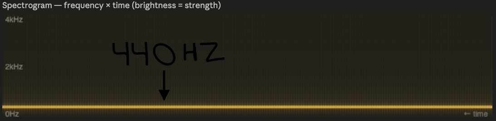

``` {python}
def speedup(t_1: float, t_2: float) -> tuple[float, bool]:
    """The multiplier speedup of one greater runtime vs. another"""
    if t_1 <= 0.0 or t_2 <= 0.0:
        raise ValueError("The runtimes must be greater than 0")
    elif t_1 > t_2:
        return (t_1 / t_2, True)
    else:
        return (t_2 / t_1, False)

def speedup_percentage(SU: float, N: int) -> float:
    """
    What percent of the ideal speedup was achieved
    """
    return (SU / N) * 100

def parallel_fraction(SU: float, N: int) -> float:
    """
    Compute P% (percentage of the program that is 
    parallelizable) from observed speedup and number of workers.
    Parameters: SU | Speedup, N | thread/core count
    """
    return (SU - 1) / (SU * (1 - 1/N))
```

# What I'm Researching

The goal of this report is to compare the effects of threading an FFT algorithm in both the C language and the Rust language.

## What is FFT?

FFT is the abbreviation for Fast Fourier Transform. A Fourier Transform is an algorithm that takes a wave signal over time and extracts how much of a frequency there is in the wave signal.

A common application that you may have seen for this algorithm is to create a spectrogram. For music, a spectrogram basically tells you how much of a frequency there is plotted over the time of the audio that you're listening to.

The "Fast" in the name relates to the fact that it has been made more efficient over time relative to the original Fourier Transform algorithm. For example, the Cooley–Tukey algorithm. Which you can read more about [here](https://en.wikipedia.org/wiki/Fast_Fourier_transform#Algorithms:~:text=%5Bedit%5D-,Cooley%E2%80%93Tukey%20algorithm,-%5Bedit%5D)

## Input Data Used

I used $\sin()$ to generate waves for the FFT algorithm.
Wave Parameters:

- Frequency
    - $440$ hz (A4 note. What all notes are based on in modern music)
- Sample Rate
    - $44100.0$ hz (default for CDs)
- FFT Size
    - $1 << 26 = 67,108,864$

### Implications of the Input Data

By using a sine wave, we can expect that the peak magnitude (our goal value) will be half of the size of what we choose for our FFT size.

This is due to the form of the DFT (Discrete Fourier Transform) equation $\sin(\theta) = \frac{e^{j\theta} - e^{-j\theta}}{2j}$; which ends up simplifying to $N / 2$ when computed with a pure sine wave.



## Libraries Used

### C

#### Threading: 
- OpenMP

#### FFT:
- `fftw3`

### Rust

#### Threading: 
- `std::thread`

#### FFT
- rustfft
    - `num_complex::Complex`
    - `FftPlanner`

## Compiling

### C

- `CFLAGS = -Wall -Ofast -fopenmp`
    - `-Ofast` is most relevant to speeding up mathematical operations.
- `LDFLAGS = -lfftw3f_omp -lfftw3f -lm -fopenmp`

### Rust

- `rustflags = ["-C", "target-cpu=native"]`
    - `target-cpu=native` is most relevant to speeding up mathematical operations.

```toml
[profile.release]
lto = true
codegen-units = 1
```

- `lto` 
    - Improves link of the main program and its depedencies.
- `codegen-units`
    - Avoids splitting the program into chunks during compilation.

## Machine Used

### CPU Specs
```bash
$ lscpu
Architecture:                x86_64
  CPU op-mode(s):            32-bit, 64-bit
  Address sizes:             40 bits physical, 48 bits virtual
  Byte Order:                Little Endian
CPU(s):                      8
  On-line CPU(s) list:       0-7
Vendor ID:                   AuthenticAMD
  Model name:                QEMU Virtual CPU version 2.5+
    CPU family:              15
    Model:                   107
    Thread(s) per core:      1
    Core(s) per socket:      8
    Socket(s):               1
    Stepping:                1
    BogoMIPS:                7797.06
    Flags:                   fpu de pse tsc msr pae mce cx8 apic sep \ 
                             mtrr pge mca cmov pat pse36 clflush mmx \ 
                             fxsr sse sse2 ht syscall nx lm rep_good \ 
                             nopl cpuid extd_apicid
                             tsc_known_freq pni ssse3 cx16 sse4_1 sse4_2 \ 
                             x2apic popcnt aes hypervisor lahf_lm cmp_legacy \ 
                             3dnowprefetch vmmcall
Virtualization features:     
  Hypervisor vendor:         KVM
  Virtualization type:       full
Caches (sum of all):         
  L1d:                       512 KiB (8 instances)
  L1i:                       512 KiB (8 instances)
  L2:                        4 MiB (8 instances)
  L3:                        128 MiB (8 instances)
NUMA:                        
  NUMA node(s):              1
  NUMA node0 CPU(s):         0-7
Vulnerabilities:             
  Gather data sampling:      Not affected
  Indirect target selection: Not affected
  Itlb multihit:             Not affected
  L1tf:                      Not affected
  Mds:                       Not affected
  Meltdown:                  Not affected
  Mmio stale data:           Not affected
  Reg file data sampling:    Not affected
  Retbleed:                  Not affected
  Spec rstack overflow:      Not affected
  Spec store bypass:         Not affected
  Spectre v1:                Mitigation; usercopy/swapgs barriers and __user \ 
                                         pointer sanitization
  Spectre v2:                Mitigation; Retpolines; STIBP disabled; \ 
                                         RSB filling; PBRSB-eIBRS Not affected; \ 
                                         BHI Not affected
  Srbds:                     Not affected
  Tsa:                       Not affected
  Tsx async abort:           Not affected
  Vmscape:                   Not affected
```

### RAM Specs
```bash
$ free -h
        total        used        free      shared  buff/cache   available
Mem:    15Gi       9.8Gi       2.9Gi       1.0Mi       2.9Gi       5.5Gi
Swap:   4.0Gi       0.0Ki       4.0Gi
```

## Threading Methodology

In C, the threading was already implemented for the FFT algorithm. It was implemented using OpenMP.

Rust was implemented using chunks of the buffer and then spawning a thread per each chunk and running FFT on each chunk.


::: {.callout-caution}

The peak magnitude is different between thread counts for the Rust implementation.

This is due to the fact that the FFT equation's max possible peak is relative to how many samples are available to be processed. So no peak will be any greater than $1 / \text{THREAD\_COUNT}$ for parallelized FFTs in Rust.

:::


# Data

## Data collection

I ran the `c-fft/main.c` and `rust-fft/src/main.rs` programs using the `benchmark.sh` `bash` program.

The output for the `bash` program can be found in `test-output/vrserver/`. "vrserver" being the name of my machine that I tested on.

I scraped the data from the output files using `parse_benchmarks.py`. The output for the parsing can be found in the `.csv` files that are in the root of the project.

## Data Results

``` {python}
import pandas as pd # for referencing csvs
import matplotlib.pyplot as plt
df = pd.read_csv("benchmark_stats.csv")
df.style.hide(axis='index')
```

### Time by Thread Count
``` {python}
fig, ax = plt.subplots()

for lang in ["C", "rust"]:
    sub = df[df.language == lang]
    ax.errorbar(
        sub.thread_count, sub.mean_real_time, yerr=sub.stdev_real_time,
        marker="o", label=f"{lang} (20 runs)"
    )

ax.set_xlabel("Thread count")
ax.set_ylabel("Mean real time (s)")
ax.legend()
```

### Speedups
```{python}
C_seq_v_4, _ = speedup(df.loc[0, "mean_real_time"], df.loc[1, "mean_real_time"])
C_seq_v_4_sp = speedup_percentage(C_seq_v_4, 4)
C_seq_v_8, _ = speedup(df.loc[0, "mean_real_time"], df.loc[2, "mean_real_time"])
C_seq_v_8_sp = speedup_percentage(C_seq_v_8, 8)
print(f"C 1→4: {C_seq_v_4:.2f}x")
print(f"    Percentage of linear ideal speedup achieved: {C_seq_v_4_sp:.2f}")
print(f"C 1→8: {C_seq_v_8:.2f}x")
print(f"    Percentage of linear ideal speedup achieved: {C_seq_v_8_sp:.2f}")

Rust_seq_v_4, _ = speedup(df.loc[3, "mean_real_time"], df.loc[4, "mean_real_time"])
Rust_seq_v_4_sp = speedup_percentage(Rust_seq_v_4, 4)
Rust_seq_v_8, _ = speedup(df.loc[3, "mean_real_time"], df.loc[5, "mean_real_time"])
Rust_seq_v_8_sp = speedup_percentage(Rust_seq_v_8, 8)
print(f"Rust 1→4: {Rust_seq_v_4:.2f}x")
print(f"    Percentage of linear ideal speedup achieved: {Rust_seq_v_4_sp:.2f}")
print(f"Rust 1→8: {Rust_seq_v_8:.2f}x")
print(f"    Percentage of linear ideal speedup achieved: {Rust_seq_v_8_sp:.2f}")

c_v_rust_seq, second_faster = speedup(df.loc[0, "mean_real_time"], df.loc[3, "mean_real_time"])
c_v_rust_4t, second_faster_4 = speedup(df.loc[1, "mean_real_time"], df.loc[4, "mean_real_time"])
c_v_rust_8t, second_faster_8 = speedup(df.loc[2, "mean_real_time"], df.loc[5, "mean_real_time"])

print("\n")
print(f"C seq vs Rust seq: {c_v_rust_seq:.2f}x ({'Rust' if second_faster else 'C'} faster)")
print(f"C 4t vs Rust 4t: {c_v_rust_4t:.2f}x ({'Rust' if second_faster_4 else 'C'} faster)")
print(f"C 8t vs Rust 8t: {c_v_rust_8t:.2f}x ({'Rust' if second_faster_8 else 'C'} faster)")
```

### Parallel Percentage Estimate
```{python}
print(f"C P%: {parallel_fraction(C_seq_v_4, 4):.2%}")
print(f"Rust P%: {parallel_fraction(Rust_seq_v_4, 4):.2%}")
```

## Data Analysis

The runtimes for Rust had a lower standard deviation than C.

Both threading methods in C and Rust did improve the speed of the base program by at least $2$ times.

Rust saw the greatest speedup with a $3.43$ times increase in speedup from $1$ thread to $8$ threads.

Nevertheless across all thread counts, C was faster than Rust by at least $1.19$ times.

Which is surprising because the C program was actually theoretically less parallelizaable at $73.48$% parallelizable vs. Rust at $83.53$%.

## Conclusions

With my "vrserver" machine, under the conditions I have set for testing in this research, I can conclude that the C programming language running OpenMP using the `fftw3` threading library in `c-fft/main.c` runs faster than the Rust language running its standard threading library and `rustfft` in `rust-fft/src/main.rs`.

I can also conclude that Rust benefits more from higher thread counts than C in this case. Even though more of the Rust code was parallelizable than the C code in theory.

### Reasoning For Results

I believe that the program did not see a much faster speedup between 4 threads and 8 threads due to a problem size that was too small. I could run it again at a higher problem size but I did not have enough time to do it.

I believe the reason that Rust performed slower than C is due to differences in optimization between the languages.

The `fftw3` library had threading built in whereas the Rust library did not have it built in. I also only tested it on one device. I believe there could be differences between what Rust has been optimized for between devices.

I'm also not exactly sure how the C library handles the threading of the FFT. [This](https://www.fftw.org/fftw3_doc/Usage-of-Multi_002dthreaded-FFTW.html) is the page from the maintainers but I don't think it says how they decided to implement it. It could just be more efficient than my chunk approach in my Rust program.

I do know that I can parallelize the `peak_mag` finding for loop in C. I did parallelize it in Rust but as you can tell from the data, it didn't provide a faster speed than the C program.
